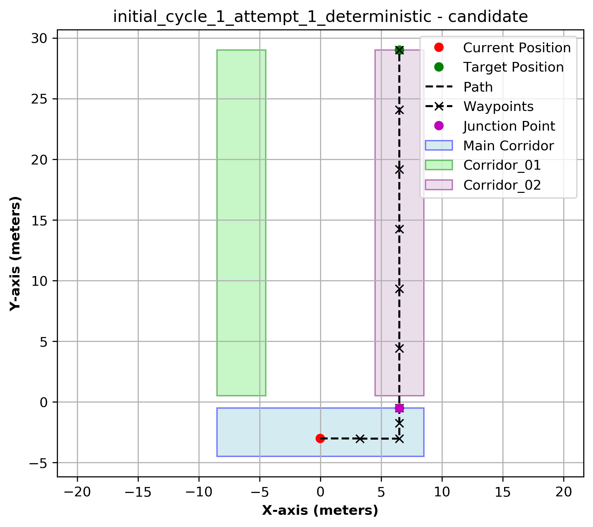

# 🤖 LLM-Based Mobile Robot Path Planning

---

## 📌 Overview

This project introduces a novel framework that embeds **Large Language Models (LLMs)** into mobile robot navigation systems. The framework translates high‑level natural language commands into dynamic, collision‑free waypoints, enabling robots to navigate and re‑plan in complex environments without retraining.

> The proposed approach integrates real‑time obstacle avoidance and voice‑command interaction. Experimental results across multiple environments demonstrate that our Llama3.1‑based framework significantly improves path planning efficiency, waypoint generation success rates, and collision avoidance.

🎥 **Video Demo**  
  
*Click the image to watch the LLM‑based replanning in action. (Replace `YOUR_VIDEO_ID` with your actual YouTube video ID.)*

> If you prefer to embed an MP4 file directly, place `assets/simulation_demo.mp4` in the repository and use:
> `<video src="assets/simulation_demo.mp4" controls width="600"></video>`

---

## 🗺️ Path Planning & Replanning Results

The robot starts at **(10, 1)** and must reach **(10, 29)**. When obstacles block the main corridor (x = 10), the LLM triggers a replan, generating alternative waypoints (e.g., deviating to x = 9 or x = 11).

| **Initial Path (Cycle 1)** | **Validated Path (Cycle 1)** |
|:---:|:---:|
| *LLM‑generated candidate waypoints* | *Final validated trajectory* |
|  |  |

| **Replan Cycle 2 – Candidate** | **Replan Cycle 2 – Validated** |
|:---:|:---:|
| *New waypoints after obstacle detection* | *Adjusted collision‑free path* |
|  |  |

| **Replan Cycle 3 – Candidate** | **Replan Cycle 3 – Validated** |
|:---:|:---:|
| *Multiple obstacle waypoints* | *Final safe path* |
|  |  |

> *All plots show coordinates in meters. The robot dynamically adjusts its plan when obstacles are detected (e.g., at x ≈ 10, y ≈ 15–20).*

---

## 🚀 Key Features

- 🧠 **LLM‑Powered Planning** – Uses Llama3.1, Qwen2.5, or Mathstral for waypoint generation  
- 🗣️ **Voice Commands** – Integrated Google Speech Recognition for intuitive human‑robot interaction  
- 🔄 **Real‑time Replanning** – Dynamically adjusts paths in response to obstacles  
- 🎮 **Simulation Ready** – Full ROS + Gazebo integration with TurtleBot3  
- 📊 **Multi‑Model Testing** – Easily switch between different LLM backends  

---

## 📁 Repository Structure
